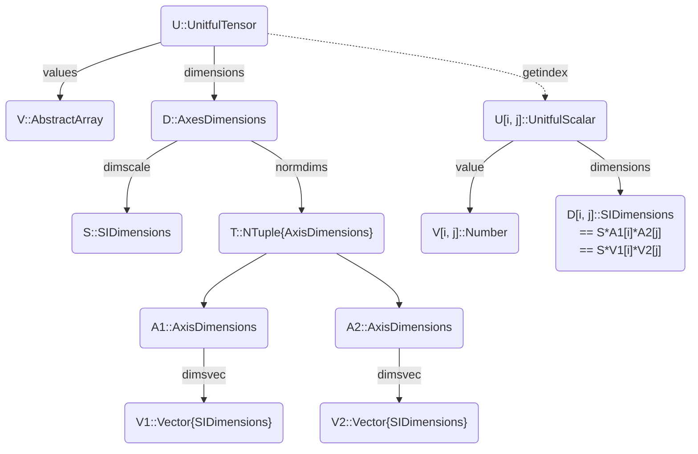

# UnitfulTensors.jl

*A package for working efficiently with arrays of physical quantities.*

[](https://anonymous-shrew.github.io/UnitfulTensors.jl/)
[](https://github.com/anonymous-shrew/UnitfulTensors.jl/actions?query=workflow%3ACI)
[](https://codecov.io/github/anonymous-shrew/UnitfulTensors.jl/branch/master)

Currently it is experimental and mostly focused on linear algebra.

## Features

- Support for arrays with mixed units
- Indexing and assignment: scalar indices, multidimensional indices, logical indexing, omitted/trailing singleton dimensions
- Arithmetic: +, -, *, \\, /, ^, sqrt, dot, cross, kron, inv, pinv, lmul!, rmul!, ldiv!, rdiv!
- Transcendental functions of matrices
- adjoint, transpose
- det, logdet, logabsdet, tr
- Factorizations: lu, bunchkaufman, cholesky, ldlt, eigen, hessenberg, schur, svd, lq, qr
- Norm and related functions: cond, condskeel, norm, normalize, nullspace, opnorm, rank
- Rotations and reflections: rotate!, reflect!, givens
- Solving Lyapunov and Sylvester equations
- Support for sparse matrices
- Moderate runtime overhead, often negligible
- Zero-overhead mode with `units_off`: check the units on a small-scale problem > turn them off > proceed with a large-scale problem

Not implemented yet:
- General array manipulation: hcat, vcat, repeat, reshape, permutedims, sort, etc.
- Elementwise operations

Future plans:
- Add support for frames of reference
- Further optimizations: NoAxisDimensions, InverseAxisDimensions, memoization
- Replace `FastQuantities` with [DynamicQuantities.jl](https://github.com/SymbolicML/DynamicQuantities.jl)
- [Tullio.jl](https://github.com/mcabbott/Tullio.jl)/[TensorCast.jl](https://github.com/mcabbott/TensorCast.jl) integration

## Basic usage

- Add `using UnitfulTensors` at the top of your script
- Add units to your inputs and constants: `ħ = 1.054571817e-34 * u"J*s"`
- Create `UnitfulTensor`s instead of arrays: `UnitfulTensor([1u"s" 2u"m"; 3u"m" 4u"m^2/s"])`
- Now linear algebra functions should just work

## Showcase

```julia
using UnitfulTensors, LinearAlgebra

# h-parameters
H = UnitfulTensor([3.7u"kΩ" 1.3e-4
                   120      8.7u"μS"])
Zₛ = 50u"Ω" # Source impedance
Yₗ = 20u"mS" # Load admittance
Hₛ = deepcopy(H)
Hₛ[1, 1] += Zₛ
Zout = inv(Hₛ)[2, 2] # Output impedance
Hₛₗ = H + Diagonal(UnitfulTensor([Zₛ, Yₗ]))
Gₜ = 4 * Zₛ * Yₗ * (Hₛₗ[2, 1] / det(Hₛₗ))^2 # Transducer power gain
Gₜ₂ = 4 * Zₛ * Yₗ * (inv(Hₛₗ)[2, 1])^2 # Equivalent expression
println((Zout, value(Zout), Zout/1u"kΩ"))
println((Gₜ, Gₜ₂))

# output

(220264.31718061675 kg m^2 A^-2 s^-3, 220264.31718061675, 220.26431718061676)
(10.2353526224919, 10.2353526224919)
```

## Performance

### Dense 3×3 matrix

```julia
using UnitfulTensors, BenchmarkTools
        
N = 3

A = randn(N, N)
b = randn(N)

uA = UnitfulTensor(A, 𝐋 * nodims(N, N))
ub = UnitfulTensor(b, 𝐌 * nodims(N))

println("Matrix * vector:")
@btime $A * $b
@btime $uA * $ub
println("Matrix * matrix:")
@btime $A * $A
@btime $uA * $uA
println("Solving a linear system:")
@btime $A \ $b
@btime $uA \ $ub

# output

Matrix * vector:
  119.563 ns (1 allocation: 80 bytes)
  160.231 ns (1 allocation: 80 bytes)
Matrix * matrix:
  82.297 ns (1 allocation: 128 bytes)
  115.884 ns (1 allocation: 128 bytes)
Solving a linear system:
  671.548 ns (3 allocations: 288 bytes)
  861.569 ns (5 allocations: 576 bytes)
```

### Laplacian on a 10×10 grid, dense and sparse

```julia
using UnitfulTensors, LinearAlgebra, SparseArrays, BenchmarkTools

Nx = 10
N = Nx^2

Δ1d = Tridiagonal(fill(1., Nx - 1), fill(-2., Nx), fill(1., Nx - 1))
𝟙 = I(Nx)

Δ = kron(Δ1d, 𝟙) + kron(𝟙, Δ1d)
Δs = sparse(Δ)
ρ = randn(N)

uΔ = UnitfulTensor(Δ, 𝐋^-2 * nodims(N, N))
uΔs = UnitfulTensor(Δs, 𝐋^-2 * nodims(N, N))
uρ = UnitfulTensor(ρ * u"C/m^3")

println("Matrix * vector:")
@btime $Δ * $ρ
@btime $uΔ * $uρ
@btime $Δs * $ρ
@btime $uΔs * $uρ
println("Matrix * matrix:")
@btime $Δ * $Δ
@btime $uΔ * $uΔ
@btime $Δs * $Δs
@btime $uΔs * $uΔs
println("Solving a linear system:")
@btime $Δ \ $ρ
@btime $uΔ \ $uρ
@btime $Δs \ $ρ
@btime $uΔs \ $uρ

# output

Matrix * vector:
  1.618 μs (1 allocation: 896 bytes)
  2.038 μs (1 allocation: 896 bytes)
  755.763 ns (1 allocation: 896 bytes)
  1.128 μs (1 allocation: 896 bytes)
Matrix * matrix:
  56.211 μs (2 allocations: 78.17 KiB)
  57.104 μs (2 allocations: 78.17 KiB)
  16.128 μs (6 allocations: 35.50 KiB)
  16.492 μs (6 allocations: 35.50 KiB)
Solving a linear system:
  150.873 μs (4 allocations: 79.92 KiB)
  153.623 μs (6 allocations: 85.67 KiB)
  455.481 μs (125 allocations: 253.85 KiB)
  455.188 μs (127 allocations: 259.60 KiB)
```

## Brief API overview



`UnitfulTensor` represents an array of unitful quantities
that can be used in linear or multilinear algebra.
It stores an `AbstractArray` of numerical values
and `AxesDimensions` that represent its physical dimensions.

For the numerical values, you can use basic `Array`, sparse matrices, `StaticArrays`, etc.,
but not `OffsetArrays` or anything else with non-standard indexing.

The physical dimensions must be of tensor product form,
otherwise such an array couldn't be multiplied by any vector.
For example, the dimensions of a `UnitfulMatrix`
are the product of its row and column dimensions.

To ensure that this decomposition is unique,
the row and column dimensions are normalized (divided by scalar factors
so that the first row and column dimensions are `NoDims`.
The combined normalization factor is stored as a separate field that can be
accessed via `dimscale`, while the dimensions along each axis are stored
as `AxisDimensions` objects and can be accessed via `normdims`.

## Related work
- In Julia: [Goretkin](https://github.com/goretkin/UnitfulLinearAlgebra.jl),
  [Gebbie](https://github.com/ggebbie/UnitfulLinearAlgebra.jl),
  [more](https://github.com/ggebbie/UnitfulLinearAlgebra.jl/issues/6)
- In C++: [Withopf](https://www.youtube.com/watch?v=J6H9CwzynoQ),
  [Withopf](https://www.youtube.com/watch?v=4LmMwhM8ODI),
  [Withopf](https://www.youtube.com/watch?v=Gd5Gzl8V44o),
  [Withopf](https://www.youtube.com/watch?v=SLSTS-EvOx4),
  [Withopf on Sea](https://www.youtube.com/watch?v=QxECoAxqsvs),
  [Withopf](https://www.youtube.com/watch?v=aF3samjRzD4),
  [Withopf](https://meetingcpp.com/mcpp/slides/2021/Physical-units-for-matrices6397.pdf)
- In the 90s: [Hart](https://www.georgehart.com/research/multanal.html)
